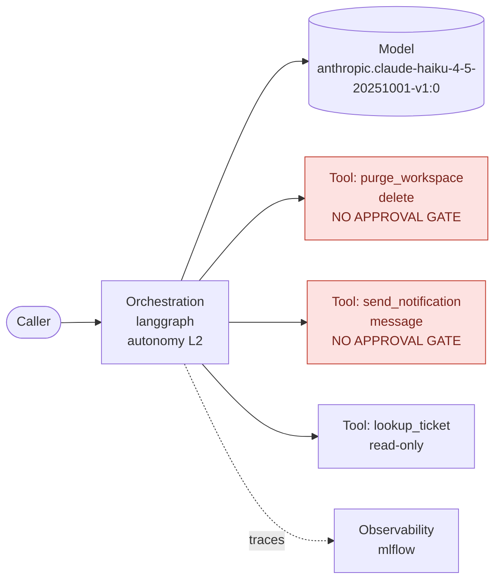

# aida-compliance — Technical Documentation

**Submission type:** Technical Documentation
**Author:** ZARGUI Rayen — rayen.zargui@ca-cib.com (solo)
**Archive:** the skill folder `aida-technical-documentation/`, complete — `SKILL.md`, seven
scripts, the section guide. It is one of the seven skills of the `aida-compliance` GitHub
Copilot plugin (with 1 agent, 1 prompt, always-on instructions) and runs inside it, on the
plugin's shared engine `aida-core`: declared in `depends_on`, listed file by file in
`SKILL.md` › Prerequisites. Python standard library only; nothing to install.

---

## What problem does it solve?

Writing the AIDA technical documentation by hand takes days, and the result goes stale the
moment the code changes. Worse, a hand-written document mixes facts nobody checked with
facts that are true, and a risk challenger cannot tell which is which.

## What does it do, and how?

Four steps, all deterministic Python run by the Copilot agent:

1. **Scan** — reads the repository into an evidence base: AI family and autonomy level
   (RAG / Prompt / Agentic L1-L3, per the AI Factory taxonomy), models, dependencies,
   endpoints, logging, tools and their side effects, infrastructure, evaluation files.
   Every finding keeps its `path:line`.
2. **Route and answer** — the risk is rated first (stakes, complexity, exposure), then each
   field of the official template is routed to where its answer may come from; the `code` and `rule` fields are answered, **after checking the
   codebase first**, and the section audits run (3.7 records, 3.8 monitoring, 3.9
   oversight). Figures, the §5 validation table, the AI System Journal and the introduction come last.
3. **Validate** — blocks a human-only field with no confirmer, a fact with no evidence, a
   loosened guideline threshold, a credential or draft text.
4. **Write** — fills the `.docx` in place and appends the completion status.

It reads the project's codebase and fills the **official AIDA Technical
Documentation template** — the real `.docx`, with its styles, numbering and table of
contents intact. One rule governs everything:

> **Every written fact carries the `path:line` that proves it. Anything the code cannot
> prove is left as a numbered open point, never invented.**

Each of the template's 105 fields is routed to where its answer may legitimately come
from — the code (cited), a guideline rule (quoted with its rule id), another internal
system (GAD, RPAD, MESARI, NSU, the MLflow run), or the risk owner. **A script never
answers a field only the risk owner can answer**: intended purpose, risk category, system
owner, named overseers. That is enforced mechanically, not by convention.

### What the generated document contains

- **§1 Introduction, assembled last from the other sections** — model conception (family,
  autonomy level, models, framework), measured predictive performance, the continuous
  monitoring set up in §3.8, the limitations the audits found (ungated irreversible tools,
  missing mandatory records, unbounded outbound calls…) and the validation status. The
  intended purpose stays an open point inside it: it is never inferred.
- **§3.3 Validation and testing, read from the evaluation files** — the evaluation
  dataset is profiled (number of cases, fields, question length, distribution per category,
  reference-answer coverage, duplicates) and checked against the guideline's minimum size
  and categories (`EVAL-RAG-QUERIES` 50, `EVAL-AGENTIC-QUERIES` 20,
  `EVAL-AGENTIC-CATEGORIES`, `EVAL-RAG-CORPUS` 20). Every experiment log (evaluation
  summaries, local MLflow runs) is listed **dated, with its metrics and the SHA-256 digest
  of its file**, so a reviewer can check it is unchanged. The most recent results are
  presented with the robustness metrics that were run, and the tests to re-run on any
  change are stated. When a file is missing, the field says so and **how to produce it** —
  signed logs go through the tamper-evident record journal. Case selection, the MLflow
  URL and the sign-off stay numbered open points.
- **§5 AIDA validation table, filled** — the template's table (AI System version |
  Changes description | AIDA Opinion | Additional Information) gets a row for this
  version: git tag or commit, the changes since the previous tag with the scope the scan
  proved, the **AIDA opinion as an open point — never written by the tool** — and the
  validation status with the blocking gaps by rule. Rows for earlier versions are kept.
- **Appendix — AI System Journal, filled (`DOC-JOURNAL`)** — the template's three-column
  table (Event | Description | Justification / corrective measures) receives each released
  version from the git history with its changes, the generation of the document, and every
  blocking gap the audits found with the control the plugin generates for it — its owner
  and due date left open. The template's example row is kept as guidance; rows the
  overseers add survive every regeneration.
- **§3.1 Data handling, from the scan** — for a pre-trained model with no in-house training,
  the data fields state what the code proves, with evidence: no training data, the knowledge
  base, how documents are loaded, chunked and embedded. Training code in the project, or a
  system not established as GenAI, leaves them to the owner; data limitations always are.
- **Proportionate to the risk** — the skill rates stakes, complexity and exposure from the
  evidence and applies the additions of each high rating (approval gates, autonomy
  justification, tool-set drift, red teaming, access log…), reporting those not applied and
  why.
- **§2.4 Hardware, stated** — accelerators the code references, or, for a model consumed
  as a managed API with none, the plain statement that no dedicated hardware is required.
- **§3.4 Performance chart, generated from stored metrics** — each metric's build-phase
  baseline (read from the project's evaluation output, e.g. `eval/outputs/*/summary.json`)
  beside the alert threshold the guideline derives from it (`MON-THRESHOLD-*`), as Mermaid
  `xychart-beta` in the document and as `performance_chart.svg`. No measured baseline, no
  chart: the section carries a numbered open point saying why. No number is ever invented.
- **§3.5 Architecture diagram, generated from the code** — a Mermaid flowchart of what the
  scan proved: API routes, orchestration framework and autonomy level, models, knowledge
  base, every tool the model can call (an irreversible tool with no approval gate is drawn
  in red), MCP servers, observability. The caption gives each component's `path:line`.

Example, generated on the agentic fixture:



The document ends with a **completion status section**: how many fields are answered, every
open point listed with its reference number (`#01`, `#02`…, the same numbers that mark it in
the text), who must answer it, and the follow-up actions until AIDA validation.

### Coverage of the template, section by section

Every row points at the code that produces the answer and the test that proves it. This
skill's scripts are in the archive; the `aida-core` scripts and the tests are in the
plugin it runs in.

| Template section | How it is answered | Produced by | Proven by |
|---|---|---|---|
| Header — name, version, versioning, documentation version | code (git tag / commit), rule (date) | `build_values.r_system_version`, `r_versioning_scheme`, `r_documentation_version` | `test_every_code_answer_carries_evidence` |
| Header — risk level, owner, authors, validation date | risk owner / governance, never answered | `placeholder_map.route` | `test_no_human_field_is_ever_answered` |
| 1 Introduction + closing status | assembled last; purpose left open; numbered open points, owners, follow-up | `write_introduction.build`, `fill_docx.closing_section` | `test_introduction_is_assembled_from_the_other_sections`, `test_closing_section_states_status_owners_and_follow_up` |
| 2.1 Overview — purpose, use cases, limitations | risk owner only | `section_values.merge` refuses a script answer | `test_intended_purpose_is_never_produced` |
| 2.2 / 2.3 Dependencies, compatibility, updates | code, with versions and `path:line`; the runtime declared — Python version, and the container image that fixes the operating system; CycloneDX ML-BOM | `build_values.r_dependencies`, `runtime_text`, `r_cicd`, `aida_bom.build_bom` | `test_dependencies_are_read_with_versions`, `test_the_runtime_names_python_and_the_image_that_fixes_the_os` |
| 2.3 How updates may affect performance | rule: every update re-runs the §3.3 tests against the baseline; a drop past the family's `MON-THRESHOLD-*` makes it a substantial change, journaled, sections regenerated; pinned dependencies counted | `build_values.r_update_effects` | `test_every_update_is_re_evaluated_against_the_family_threshold` |
| 3.1 Data handling | pre-trained model and no training code: stated with evidence; otherwise the owner's | `build_values.r_used_data`, `r_data_acquisition`, `r_pretreatment`, `r_feature_engineering` | `test_a_pre_trained_model_means_no_in_house_training_data`, `test_training_code_leaves_the_data_fields_to_the_owner` |
| 3.1 Limitations of the data | read from the evaluation profile — size below `EVAL-*`, cases without a reference answer, unbalanced categories, duplicates, a corpus below `EVAL-RAG-CORPUS`; the steps taken to handle them stay an open point | `profile_evaluation.data_limitations`, `build_values.r_data_limitations` | `test_data_limitations_come_from_the_profile_and_leave_their_handling_open` |
| 2.4 Hardware | accelerators found, or a managed API and none, stated plainly | `build_values.r_hardware` | `test_a_managed_model_api_with_no_accelerator_is_stated_plainly` |
| 3.2 Third-party models and frameworks | code | `build_values.r_third_party_models` | `test_model_id_and_region_are_extracted` |
| 3.2 Post-processing of the predictions | an output parser or a validated structured output, cited where the code does it; otherwise an open point | `build_values.r_post_processing` | `test_post_processing_is_cited_where_the_code_parses_the_output`, `test_no_post_processing_found_leaves_the_field_open` |
| 3.3 Data characteristics | dataset profiled and checked against `EVAL-*`; absent: requirement stated | `profile_evaluation.describe_data` | `test_the_dataset_is_profiled_and_checked_against_the_guideline` |
| 3.3 Dated and signed experiment logs | each log dated, metrics, SHA-256 digest; absent: how to produce signed logs | `profile_evaluation.describe_logs` | `test_every_log_is_dated_with_a_digest_and_the_sign_off_stays_open`, `test_absent_logs_say_how_to_produce_signed_logs` |
| 3.3 Metrics, procedures, future-change tests | rule (`EVAL-*`, `MON-THRESHOLD-*`, `MON-DRIFT-TOOLSET`) | `build_values.r_evaluation_metrics`, `profile_evaluation.describe_future_tests` | `test_future_change_tests_follow_the_family` |
| 3.4 Results, model logic, explainability, guardrails | latest run with robustness metrics; classification with evidence; L2/L3 justification demanded | `profile_evaluation.describe_results`, `build_values.r_model_logic` | `test_results_come_from_the_most_recent_run_and_name_robustness_metrics`, `test_autonomy_justification_is_demanded_for_l2` |
| 3.4 Performance chart | baseline vs alert threshold; no baseline, no chart, an open point | `render_figures.performance` | `test_chart_is_drawn_from_the_measured_baseline` |
| 3.5 Architecture diagram | Mermaid from the scan; ungated irreversible tools in red | `render_figures.architecture` | `test_ungated_irreversible_tools_are_marked_on_the_diagram` |
| 3.6 Deployment, CI/CD | code (Dockerfile, CI, IaC) | `build_values.r_deployment`, `r_cicd` | `test_every_code_answer_carries_evidence` |
| 3.7 Record keeping | nine mandatory records audited; hash-chained journal generated | `audit_records.audit`, `verify_chain.verify` | `test_all_nine_mandatory_records_are_checked`, `test_altering_an_entry_is_detected` |
| 3.8 Monitoring | thresholds from the measured baseline, frequency, tool-set drift, operational alerts | `plan_monitoring.build_plan`, `plan_operational.build_plan` | `test_threshold_is_derived_from_the_measured_score`, `test_an_added_tool_is_a_critical_alert` |
| 3.9 Human oversight | every tool ranked; missing gate, stop and feedback generated | `audit_oversight.audit`, `generate_controls` | `test_ungated_tools_produce_a_blocking_finding` |
| 4 Updates and changes | last change from git; cited files hashed, CI fails on drift; a substantial change goes back through the Change of usage procedure, where the risk owner re-evaluates the AI Act risk category | `build_values.r_substantial_changes`, `r_continuous_compliance`, `check_freshness.compare` | `test_a_code_change_marks_the_dependent_fields_stale`, `test_a_substantial_change_sends_the_risk_category_back_to_the_owner` |
| Appendix — AI System Journal | version history from git, generation, blocking gaps with corrective measures; example row kept | `write_journal.build`, `fill_docx.fill_table` | `test_each_released_version_is_an_event_from_the_git_history`, `test_the_journal_fills_the_appendix_table_and_keeps_the_template_example` |
| 5 Model validation | the AIDA table: version, changes, opinion (open), status and blocking gaps | `write_validation_table.build`, `fill_docx.fill_table` | `test_the_table_reaches_section_5_of_the_document`, `test_the_opinion_is_never_written_by_the_tool` |

And the rules that hold across every section:

| Cross-cutting requirement | Enforced by | Proven by |
|---|---|---|
| Every fact carries its `path:line`, or is not written | `section_values.merge`, `validate_values.validate` | `test_code_derived_value_without_evidence_is_blocked` |
| A field only the risk owner can answer is never written by a script | `section_values.merge` | `test_a_human_field_is_never_written_by_a_script` |
| Guideline numbers carry their rule id; a looser one is blocked | `validate_values.validate` | `test_loosened_threshold_is_blocked_for_a_rag_system` |
| Every open point is numbered and listed with its owner | `fill_docx.build_resolver`, `closing_section` | `test_each_reference_appears_in_the_text_and_in_the_closing_list` |
| The official template survives intact | `fill_docx.register_namespaces` | `test_namespace_prefixes_survive_the_round_trip` |
| A confirmed answer survives every regeneration | `section_values.merge` | `test_a_confirmed_answer_survives_a_regeneration` |
| The document is proportionate: stakes, complexity, exposure rated from evidence | `SKILL.md` Phase 1b | `test_an_l2_system_is_asked_to_justify_its_autonomy` |
| A project that is not an AI system is never documented as one | `scan_codebase.classify` | `test_non_ai_project_is_not_invented_into_an_ai_system` |

## How can we use your skill?

**See the result first, without installing anything** — open
`examples/ticket_agent/technical_documentation.docx` in the plugin: the official template
filled on a small LangGraph ticket agent, released
twice (`v1.0.0`, `v1.1.0`) and evaluated twice. 50 of its 106 fields are answered from
evidence; the §3.3 profile, the chart, the diagram, the §5 table and the journal are all
there, and its 81 open points are listed by owner at the end.

**In GitHub Copilot** — install the plugin from the hub marketplace, then ask in natural
language:

- *"Generate the AIDA technical documentation for this project"*
- *"Is our AIDA documentation still up to date with the code?"*

The skill scans, asks the risk owner's questions **in one block**, validates every answer,
and writes `aida/technical_documentation.docx`.

**Without Copilot** — one command runs the whole chain on any project:

```bash
python run_all.py /path/to/project --inference-frequency daily
```

Output, in `<project>/aida/`:

| File | Content |
|---|---|
| `technical_documentation.docx` | the official template, filled, with introduction, figures, the §5 validation table, the AI System Journal and the closing completion status |
| `architecture.mmd` | §3.5 architecture diagram (Mermaid) |
| `performance_chart.mmd` / `.svg` | §3.4 baseline-vs-threshold chart, when an evaluation exists |
| `technical_documentation_a_confirmer.json` | the open points, numbered, with owner and reason |
| `audit_report.md` | a scorecard of the 36 guideline requirements |
| `ml-bom.json` | a CycloneDX 1.6 inventory of models, datasets and dependencies |

The scan never modifies the project it reads, and running it twice gives the same result.

**Keeping it current** — after any change:

```bash
python skills/aida-technical-documentation/scripts/check_freshness.py check --values aida/values.json --project .
```

It hashes every source file the document cites and names the fields whose evidence moved;
exit code 1 on drift, so CI can enforce `DOC-UPDATE-ON-CHANGE`.

## Repo structure

The archive is the `aida-technical-documentation/` folder marked below. The rest of the
tree is the plugin it runs in, which provides `aida-core`.

```
aida-compliance/
├── plugin.json                  Copilot manifest (plugin root, per the CLI reference)
├── plugin.yaml                  hub manifest
├── README.md  CHANGELOG.md
├── run_all.py                   whole chain on a project, in one command
├── examples/ticket_agent/        a generated document, its diagram and chart, to open directly
├── agents/aida-reviewer.agent.md          reviews a document as a risk challenger would
├── prompts/aida-context.prompt.md         builds the evidence base in one shot
├── instructions/aida-compliance.instructions.md   evidence rules, always active
├── skills/
│   ├── aida-core/                     shared engine
│   │   ├── scripts/  scan_codebase.py  placeholder_map.py  validate_values.py
│   │   │             fill_docx.py  aida_bom.py  section_values.py
│   │   ├── references/aida_rules.json     36 rules from the 4 AI Factory guidelines
│   │   ├── references/routing.md          where each field's answer may come from, and why order matters
│   │   └── assets/templates/technical_documentation.docx   the official template
│   ├── aida-technical-documentation/  ← this submission
│   │   ├── scripts/  build_values.py  profile_evaluation.py  render_figures.py
│   │   │             write_introduction.py  write_validation_table.py  write_journal.py
│   │   │             check_freshness.py
│   │   └── references/section_guide.md    what each section expects, by rule id
│   ├── aida-record-keeping/          writes §3.7
│   ├── aida-genai-monitoring/        writes §3.8, model monitoring
│   ├── aida-operational-monitoring/  writes §3.8, operational monitoring
│   ├── aida-human-oversight/         writes §3.9
│   └── aida-audit/                   36-requirement scorecard
└── tests/evals/                  35 behavioural scenarios for the agent
```

The five document sections share one scan, so two generated sections can never contradict
each other.

## Tested on a real project?

**Yes — on three real projects from the Plugin-Skill-Hub, written by other people**, plus
three fixture projects. The whole chain ran end to end on each and produced a valid Word
document every time.

| Project | What it is | Classification | Result |
|---|---|---|---|
| AgentGrade engine (evaluation-pipeline) | LLM-as-judge evaluation harness | unknown, low certainty | honest: an evaluation tool, not a deployed AI system |
| promptopt (prompt-optimization) | prompt optimiser calling an LLM | prompt, high certainty | correct |
| hub-skill-installer | downloads skill folders from GitLab | unknown, low certainty | correct: no AI in it |

**This testing found and fixed four real faults** that fixtures alone never showed. The
installer — a download utility — first came out as a *hybrid L3 agent*, because the scanner
read documentation as code, read its own previous output, read test files as the system, and
treated every `str.encode()` as an embedding call. All four are fixed and pinned by tests; a
second run now returns exactly the same classification as the first. A fifth fault — the
validator reading an operational threshold (a 30 % fall in active users) as a loosened
model-quality threshold — was found the same way and fixed, and so was a sixth: with two
evaluation runs, the older one was taken as the monitoring baseline; the latest now is.

The fixtures cover the three cases that matter: a RAG service, a ReAct agent, and a plain
CRUD service with **no AI at all**, which proves the tool reports *no AI system* instead of
inventing one.

The plugin holds **668 tests** — unit, integration, conformance, security posture and
the real-project lessons above — in its `tests/` folder (`python -m pytest tests/ -q`).
All pass on this exact skill folder, and `make_submission.py --skill` re-runs them with
the archived copy in place before declaring the zip ready.

## Models / tools used

- **No model is called by the skill.** Classification, field routing, validation and
  document writing are deterministic Python scripts, so the result is the same whatever
  model Copilot runs with — and a compliance document does not change between two runs.
- **The agent host** — GitHub Copilot, any model — only orchestrates: it runs the scripts
  and asks the risk owner's questions.
- **Context footprint when the skill runs:** ~1,200 tokens for the seven skill
  descriptions (always loaded), then ~6,500 tokens for the two `SKILL.md` files this task
  activates (this skill's and `aida-core`'s). Scripts are executed, not read, so their size costs nothing at run time;
  references load only when a section needs them.
- **Standard library only** — no package to install, no version conflict with the audited
  project.
- **Standards:** the official AIDA template (version 04.12.2025); the four AI Factory
  guidelines; CycloneDX 1.6 for the ML-BOM; OpenTelemetry GenAI semantic conventions are
  recognised as recorded fields; the GitHub Copilot CLI plugin reference and the Agent
  Skills open standard (validated with the official `skills-ref`).

## Does it use external access?

**No.** The scripts read local files and the local git history, and write only to
`<project>/aida/`. No network call, no API, no telemetry — nothing leaves the machine.
This is enforced by tests: no script imports a network module, none calls
`eval`/`exec`/`pickle`, and no subprocess is given a shell.

Each property below is enforced by a test that fails the build:

| Agent Skills risk | What holds | Enforced by |
|---|---|---|
| AST01 malicious behaviour, exfiltration | no network module in any script; writes only under `aida/`; the audited source is never modified; a citation pointing outside the project is never read | `test_no_script_imports_a_network_module`, `test_project_source_is_never_touched`, `test_a_citation_outside_the_project_is_never_read` |
| AST02 supply chain | standard library only; every declared dependency pinned to an exact version | `test_every_declared_dependency_is_pinned_to_an_exact_version` |
| AST03 excessive permissions | `allowed-tools` is `shell(python:*)` alone — the agent runs the scripts and nothing else; the scripts read the git history themselves, with fixed read-only commands, never through a shell | `test_allowed_tools_is_scoped_to_named_commands`, `test_the_agent_is_never_granted_git`, `test_scripts_only_read_git` |
| AST04 metadata integrity | descriptions in third person, state when to use; every referenced resource exists | `test_description_is_written_in_third_person`, `test_referenced_resources_exist` |
| AST05 unsafe execution, deserialisation | no `eval` / `exec` / `compile` / `pickle`, JSON only; no subprocess given a shell | `test_no_script_evaluates_or_unpickles_input`, `test_subprocess_is_never_given_a_shell` |
| Credentials | redacted before the record journal, blocked before the document | `test_credentials_are_redacted_before_they_reach_the_journal`, `test_credentials_never_reach_the_document` |

## Limitations / known issues

- **It cannot answer what the code does not contain.** Intended purpose, risk category,
  named overseers, training data provenance, measured performance without an evaluation
  run: these stay open points. On the projects tested, **23 % to 33 % of the fields** were
  answered automatically — lower on small repositories with no Dockerfile, CI or git tags,
  higher on projects that have them. The rest is the risk owner's list, numbered and
  assigned. We would rather ship a document that is 25 % complete and 100 % sourced than
  one that is complete and partly invented.
- **Detection is static.** Tools declared in a way the scanner does not recognise, tools
  behind an MCP server, or behaviour configured only at deployment time are reported as
  gaps to confirm — never assumed absent. The tool count is stated as a floor when MCP
  servers are configured.
- **Python-first.** The syntax-tree analyses (tool inventory, logged fields, resilience)
  cover Python. Other languages get the pattern-level scan only.
- **Classification needs confirming.** Certainty is reported (low / medium / high) and the
  skill asks the user to confirm before writing, because the family decides the mandatory
  metrics of every downstream section.
- **Not a substitute for validation.** It produces the documentation and the gap list; the
  AIDA process still validates the system. Bias and fairness are out of scope, as they are
  for the evaluation guideline itself.

## Anything else worth knowing?

- **It is one plugin for all five deliverables.** Sections 3.7, 3.8 and 3.9 of this document
  are written by the same skills submitted for the Record Keeping, Monitoring and Human
  Oversight tracks, from one shared scan — so the sections can never contradict each other.
- **Check the code, then ask.** No field is routed to a human or an external system before
  the codebase has been checked for it; when the evidence is absent, the document says so
  and says how to produce it, instead of leaving a silent gap.
- **Re-running is safe.** Answers confirmed by the risk owner (`confirmed_by`) and rows
  entered in the §5 table survive every regeneration.
- **A reviewer agent is included** (`aida-reviewer`): it reads a finished document the way a
  risk challenger would and lists what it would reject.
- **Self-verifying archive:** `make_submission.py --skill` builds this zip, checks that
  every file `SKILL.md` links to is in it, then puts the archived folder back into a copy
  of the plugin and runs the test suite there before declaring it ready.

---

*Built against the AI Factory guidelines — Building Agentic AI Systems, Evaluation of GenAI
Systems, Monitoring and Human Oversight, Record Keeping. Follows `templates/plugin-template`
and `templates/skill-template` of the Plugin-Skill-Hub; manifests pass
`scripts/ci/validate_manifests.ps1`.*
