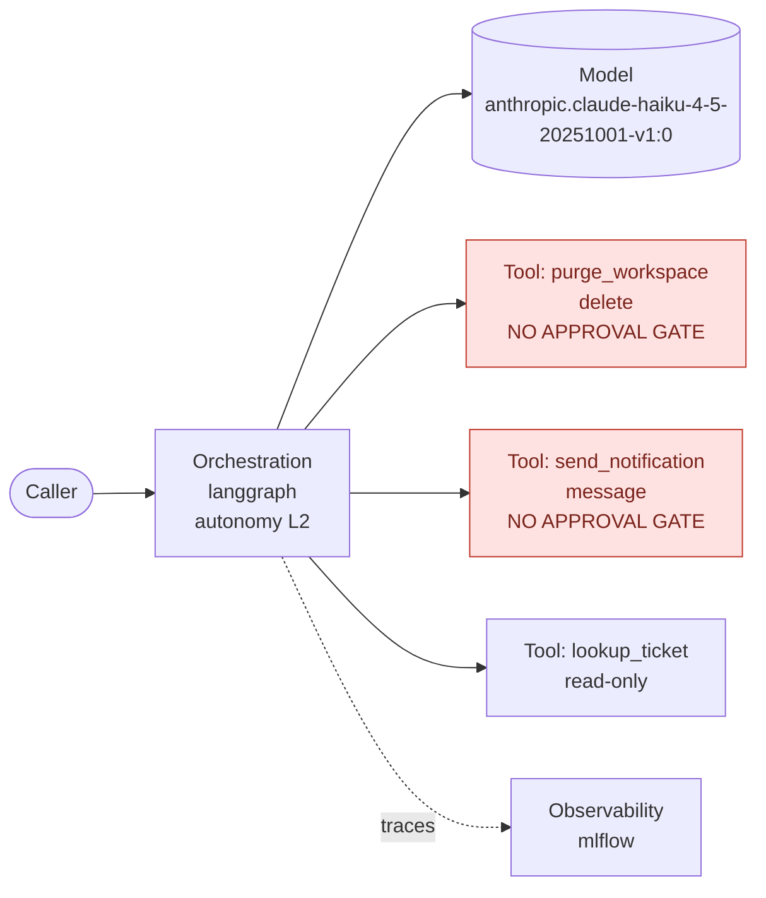

# aida-compliance — Technical Documentation

**Submission type:** Technical Documentation
**Author:** ZARGUI Rayen — rayen.zargui@ca-cib.com (solo)
**Archive:** a GitHub Copilot plugin — 7 skills, 1 agent, 1 prompt, always-on instructions.
Python standard library only; nothing to install.

---

## What problem does it solve?

Writing the AIDA technical documentation by hand takes days, and the result goes stale the
moment the code changes. Worse, a hand-written document mixes facts nobody checked with
facts that are true, and a risk challenger cannot tell which is which.

## What does it do, and how?

In four steps, all deterministic Python run by the Copilot agent:

1. **Scan** — reads the repository into an evidence base: AI family and autonomy level
   (RAG / Prompt / Agentic L1-L3, per the AI Factory taxonomy), models, dependencies,
   endpoints, logging, tools and their side effects, infrastructure. Every finding keeps
   its `path:line`.
2. **Route and answer** — maps each field of the official template to where its answer
   may come from, answers the `code` and `rule` fields, and runs the section audits
   (3.3 evaluation data, 3.7 records, 3.8 monitoring, 3.9 oversight, 3.10 security).
   Figures, introduction and the AI System Journal come last.
3. **Validate** — blocks a human-only field with no confirmer, a fact with no evidence, a
   loosened guideline threshold, a credential or draft text.
4. **Write** — fills the `.docx` in place and appends the completion status.

It reads the project's codebase and fills the **official AIDA Technical
Documentation template** — the real `.docx`, with its styles, numbering and table of
contents intact. One rule governs everything:

> **Every written fact carries the `path:line` that proves it. Anything the code cannot
> prove is left as a numbered open point, never invented.**

Each of the template's 105 fields is routed to where its answer may legitimately come
from — the code (cited), a guideline rule (quoted with its rule id), another internal
system (GAD, RPAD, MESARI, NSU, the MLflow run), or the risk owner. **A script never
answers a field only the risk owner can answer**: intended purpose, risk category, system
owner, named overseers. That is enforced mechanically, not by convention.

### What the generated document contains

- **§1 Introduction, assembled last from the other sections** — model conception (family,
  autonomy level, models, framework), measured predictive performance, the continuous
  monitoring set up in §3.8, the limitations the audits found (ungated irreversible tools,
  missing mandatory records, unbounded outbound calls…) and the validation status. The
  intended purpose stays an open point inside it: it is never inferred.
- **§3.3 Validation data and experiment logs, read from the evaluation files** — the
  evaluation dataset is profiled (number of cases, fields, question length, distribution
  per category, reference-answer and context coverage, duplicates) and checked against
  the guideline's minimum size and categories (`EVAL-RAG-QUERIES` 50, `EVAL-AGENTIC-QUERIES`
  20, `EVAL-AGENTIC-CATEGORIES`, `EVAL-RAG-CORPUS` 20). Every experiment run in the
  repository (evaluation summaries, local MLflow `mlruns/`) is listed with its date and
  metrics. How the cases were selected, the MLflow URL and the sign-off stay open points.
- **§3.10 Guardrails and red teaming, read from the code** — guardrail libraries,
  moderation, prompt-injection handling, validated output, bounded input, token budgets,
  rate limits, authenticated endpoints, red-teaming suites (DeepTeam, garak, promptfoo) and
  credential literals, each mapped to the OWASP Top 10 for LLM applications risk it mitigates
  (LLM01, 02, 05, 06, 10). An uncovered risk is a gap to confirm — it may be enforced on the
  platform — never a claim of absence. A credential is reported by location, never copied.
- **Appendix — AI System Journal, opened (`DOC-JOURNAL`, blocking)** — the template's
  journal table receives one row for the generation and one per blocking gap the audits
  found: event, description with evidence, corrective measure (the control the plugin
  generates for it) and its owner and due date as a numbered open point. Rows the overseers
  add later are kept on every regeneration.
- **§3.4 Performance chart, generated from stored metrics** — each metric's build-phase
  baseline (read from the project's evaluation output, e.g. `eval/outputs/*/summary.json`)
  beside the alert threshold the guideline derives from it (`MON-THRESHOLD-*`), as Mermaid
  `xychart-beta` in the document and as `performance_chart.svg`. No measured baseline, no
  chart: the section carries a numbered open point saying why. No number is ever invented.
- **§3.5 Architecture diagram, generated from the code** — a Mermaid flowchart of what the
  scan proved: API routes, orchestration framework and autonomy level, models, knowledge
  base, every tool the model can call (an irreversible tool with no approval gate is drawn
  in red), MCP servers, observability. The caption gives each component's `path:line`.

Example, generated on the agentic fixture:



The document ends with a **completion status section**: how many fields are answered, every
open point listed with its reference number (`#01`, `#02`…, the same numbers that mark it in
the text), who must answer it, and the follow-up actions until AIDA validation.

## How can we use your skill?

**In GitHub Copilot** — install the plugin from the hub marketplace, then ask in natural
language:

- *"Generate the AIDA technical documentation for this project"*
- *"Is our AIDA documentation still up to date with the code?"*

The skill scans, asks the risk owner's questions **in one block**, validates every answer,
and writes `aida/technical_documentation.docx`.

**Without Copilot** — one command runs the whole chain on any project:

```bash
python run_all.py /path/to/project --inference-frequency daily
```

Output, in `<project>/aida/`:

| File | Content |
|---|---|
| `technical_documentation.docx` | the official template, filled, with introduction, figures, the AI System Journal and the closing completion status |
| `architecture.mmd` | §3.5 architecture diagram (Mermaid) |
| `performance_chart.mmd` / `.svg` | §3.4 baseline-vs-threshold chart, when an evaluation exists |
| `technical_documentation_a_confirmer.json` | the open points, numbered, with owner and reason |
| `audit_report.md` | a scorecard of the 36 guideline requirements |
| `ml-bom.json` | a CycloneDX 1.6 inventory of models, datasets and dependencies |

The scan never modifies the project it reads, and running it twice gives the same result.

**Keeping it current** — after any change:

```bash
python skills/aida-technical-documentation/scripts/check_freshness.py check --values aida/values.json --project .
```

It hashes every source file the document cites and names the fields whose evidence moved;
exit code 1 on drift, so CI can enforce `DOC-UPDATE-ON-CHANGE`.

## Repo structure

```
aida-compliance/
├── plugin.json                  Copilot manifest (plugin root, per the CLI reference)
├── plugin.yaml                  hub manifest
├── README.md  CHANGELOG.md
├── run_all.py                   whole chain on a project, in one command
├── agents/aida-reviewer.agent.md          reviews a document as a risk challenger would
├── prompts/aida-context.prompt.md         builds the evidence base in one shot
├── instructions/aida-compliance.instructions.md   evidence rules, always active
├── skills/
│   ├── aida-core/                     shared engine
│   │   ├── scripts/  scan_codebase.py  placeholder_map.py  validate_values.py
│   │   │             fill_docx.py  aida_bom.py  section_values.py
│   │   ├── references/aida_rules.json     36 rules from the 4 AI Factory guidelines
│   │   └── assets/templates/technical_documentation.docx   the official template
│   ├── aida-technical-documentation/  ← this submission
│   │   ├── scripts/  build_values.py  profile_evaluation.py  audit_security.py
│   │   │             render_figures.py  write_introduction.py  write_journal.py
│   │   │             check_freshness.py
│   │   └── references/section_guide.md    what each section expects, by rule id
│   ├── aida-record-keeping/          writes §3.7
│   ├── aida-genai-monitoring/        writes §3.8, model monitoring
│   ├── aida-operational-monitoring/  writes §3.8, operational monitoring
│   ├── aida-human-oversight/         writes §3.9
│   └── aida-audit/                   36-requirement scorecard
└── tests/evals/                  35 behavioural scenarios for the agent
```

The five document sections share one scan, so two generated sections can never contradict
each other.

## Tested on a real project?

**Yes — on three real projects from the Plugin-Skill-Hub, written by other people**, plus
three fixture projects. The whole chain ran end to end on each and produced a valid Word
document every time.

| Project | What it is | Classification | Result |
|---|---|---|---|
| AgentGrade engine (evaluation-pipeline) | LLM-as-judge evaluation harness | unknown, low certainty | honest: an evaluation tool, not a deployed AI system |
| promptopt (prompt-optimization) | prompt optimiser calling an LLM | prompt, high certainty | correct |
| hub-skill-installer | downloads skill folders from GitLab | unknown, low certainty | correct: no AI in it |

**This testing found and fixed four real faults** that fixtures alone never showed. The
installer — a download utility — first came out as a *hybrid L3 agent*, because the scanner
read documentation as code, read its own previous output, read test files as the system, and
treated every `str.encode()` as an embedding call. All four are fixed and pinned by tests; a
second run now returns exactly the same classification as the first. A fifth fault — the
validator reading an operational threshold (a 30 % fall in active users) as a loosened
model-quality threshold — was found the same way and fixed.

The fixtures cover the three cases that matter: a RAG service, a ReAct agent, and a plain
CRUD service with **no AI at all**, which proves the tool reports *no AI system* instead of
inventing one.

The repository holds **594 tests** — unit, integration, conformance, security posture,
and the real-project lessons above. `python -m pytest tests/ -q` from the plugin folder.

## Models / tools used

- **No model is called by the skill.** Classification, field routing, validation and
  document writing are deterministic Python scripts, so the result is the same whatever
  model Copilot runs with — and a compliance document does not change between two runs.
- **The agent host** — GitHub Copilot, any model — only orchestrates: it runs the scripts
  and asks the risk owner's questions.
- **Context footprint when the skill runs:** ~1,200 tokens for the seven skill
  descriptions (always loaded), then ~4,000 tokens for the two `SKILL.md` files this task
  activates. Scripts are executed, not read, so their size costs nothing at run time;
  references load only when a section needs them.
- **Standard library only** — no package to install, no version conflict with the audited
  project.
- **Standards:** the official AIDA template (version 04.12.2025); the four AI Factory
  guidelines; CycloneDX 1.6 for the ML-BOM; OpenTelemetry GenAI semantic conventions are
  recognised as recorded fields; the GitHub Copilot CLI plugin reference and the Agent
  Skills open standard (validated with the official `skills-ref`).

## Does it use external access?

**No.** The scripts read local files and the local git history, and write only to
`<project>/aida/`. No network call, no API, no telemetry — nothing leaves the machine.
This is enforced by tests: no script imports a network module, none calls
`eval`/`exec`/`pickle`, and no subprocess is given a shell.

`allowed-tools` pre-approves only the commands each skill runs — `shell(python:*)`, and
`shell(git:*)` for the three skills that read git history — never the whole shell. Every
dependency in the archive is pinned to an exact version.

## Limitations / known issues

- **It cannot answer what the code does not contain.** Intended purpose, risk category,
  named overseers, training data provenance, measured performance without an evaluation
  run: these stay open points. On the projects tested, **19 % to 26 % of the fields** were
  answered automatically — lower on small repositories with no Dockerfile, CI or git tags,
  higher on projects that have them. The rest is the risk owner's list, numbered and
  assigned. We would rather ship a document that is 25 % complete and 100 % sourced than
  one that is complete and partly invented.
- **Detection is static.** Tools declared in a way the scanner does not recognise, tools
  behind an MCP server, or behaviour configured only at deployment time are reported as
  gaps to confirm — never assumed absent. The tool count is stated as a floor when MCP
  servers are configured.
- **Python-first.** The syntax-tree analyses (tool inventory, logged fields, resilience)
  cover Python. Other languages get the pattern-level scan only.
- **Classification needs confirming.** Certainty is reported (low / medium / high) and the
  skill asks the user to confirm before writing, because the family decides the mandatory
  metrics of every downstream section.
- **Not a substitute for validation.** It produces the documentation and the gap list; the
  AIDA process still validates the system. Bias and fairness are out of scope, as they are
  for the evaluation guideline itself.

## Anything else worth knowing?

- **It is one plugin for all five deliverables.** Sections 3.7, 3.8 and 3.9 of this document
  are written by the same skills submitted for the Record Keeping, Monitoring and Human
  Oversight tracks, from one shared scan — so the sections can never contradict each other.
- **Re-running is safe.** Answers confirmed by the risk owner (`confirmed_by`) survive every
  regeneration, and `check_freshness.py` names the fields whose cited code has moved.
- **A reviewer agent is included** (`aida-reviewer`): it reads a finished document the way a
  risk challenger would and lists what it would reject.
- **Self-verifying archive:** `make_submission.py` builds this zip, extracts it to a
  temporary folder and runs the test suite there before declaring it ready.

---

*Built against the AI Factory guidelines — Building Agentic AI Systems, Evaluation of GenAI
Systems, Monitoring and Human Oversight, Record Keeping. Follows `templates/plugin-template`
and `templates/skill-template` of the Plugin-Skill-Hub; manifests pass
`scripts/ci/validate_manifests.ps1`.*
